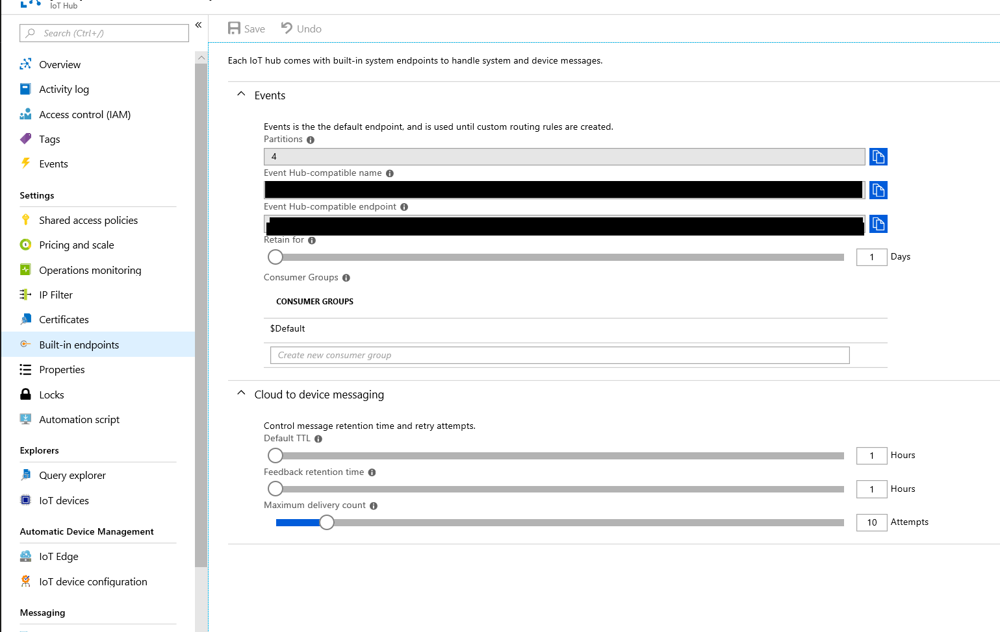

# Run End to End Tests

This document describes how to run the end to end tests located under the c\iothub_client\tests\ folder in your local copy of the repository.

- [Setup the test parameters](#testparams)
- [Run end to end tests on a Windows development environment](#windows)
- [Run end to end tests on a Linux development environment](#linux)

<a name="testparams"/>
## Setup the test parameters

- Open the file "iot_device_params.txt" located under the tools\iot_hub_e2e_tests_params folders in your local copy of the repository.
- Populate the information required in this file by extracting it from the Azure portal & Device Explorer.
    - Open the Azure IoT Hub you created in the Azure portal and navigate through "All Settings", "Shared Access Policies", and "iothubowner" as shown in the figure below.
    
    

    - Locate one of the IoT Hub connection strings as shown in the figure below
    
        

    - The connection string will be in the following form: HostName=<IOTHUB_NAME>.<IOTHUB_SUFFIX>;SharedAccessKeyName=<IOTHUB_POLICY_NAME>;SharedAccessKey=<IOTHUB_POLICY_KEY>
    - Populate the following variables in the "iot_device_params.txt"  file by matching the place holders with the ones from the IoT Hub connection string shown above.
      
      - IOTHUB_CONNECTION_STRING=[entire connection string from azure portal]
      - IOTHUB_NAME=[IOTHUB_NAME]
      - IOTHUB_EVENTHUB_LISTEN_NAME=[samne as IOTHUB_NAME]
      - IOTHUB_SUFFIX=[IOTHUB_SUFFIX]
      - IOTHUB_POLICY_NAME=iothubowner
      - IOTHUB_POLICY_KEY=[IOTHUB_POLICY_KEY]
      - IOTHUB_EVENTHUB_ACCESS_KEY=[same as IOTHUB_POLICY_KEY]
     
    - Locate the Event Hub settings as shown in the figure below

    

    - Populate the following variables as described below.

      - IOTHUB_EVENTHUB_LISTEN_NAME=[same as IOTHUB_NAME]
      - IOTHUB_EVENTHUB_CONNECTION_STRING=[Event Hub-compatible endpoint];SharedAccessKeyName=[IOTHUB_POLICY_NAME];SharedAccessKey=[IOTHUB_POLICY_KEY]
      - IOTHUB_EVENTHUB_CONSUMER_GROUP=$Default
      - IOTHUB_PARTITION_COUNT=[Partition count from portal]

    - Populate the following variables in the "iot_device_params.txt" by exracting the information from Device Explorer.

      - IOTHUB_DEVICE_ID=[The ID for the devie you created under the Management tab]
      - IOTHUB_DEVICE_KEY=[The key for the devie you created under the Management tab]
      - IOTHUB_SHARED_ACCESS_SIGNATURE=[By clicking the "Generate SAS" button]

    

<a name="windows"/>
## Run end to end tests on a Windows development environment

- Start the Windows PowerShell in Administrator mode.
- Run the script "Set-IOTDeviceParametersForE2ETests.ps1" located under the tools\iot_hub_e2e_tests_params folders in your local copy of the repository.
- Start the Visual Studio solution 

<a name="linux"/>
## Run end to end tests on a Linux development environment

- Run the script "setiotdeviceparametersfore2etests.sh" located under the tools\iot_hub_e2e_tests_params folders in your local copy of the repository.
