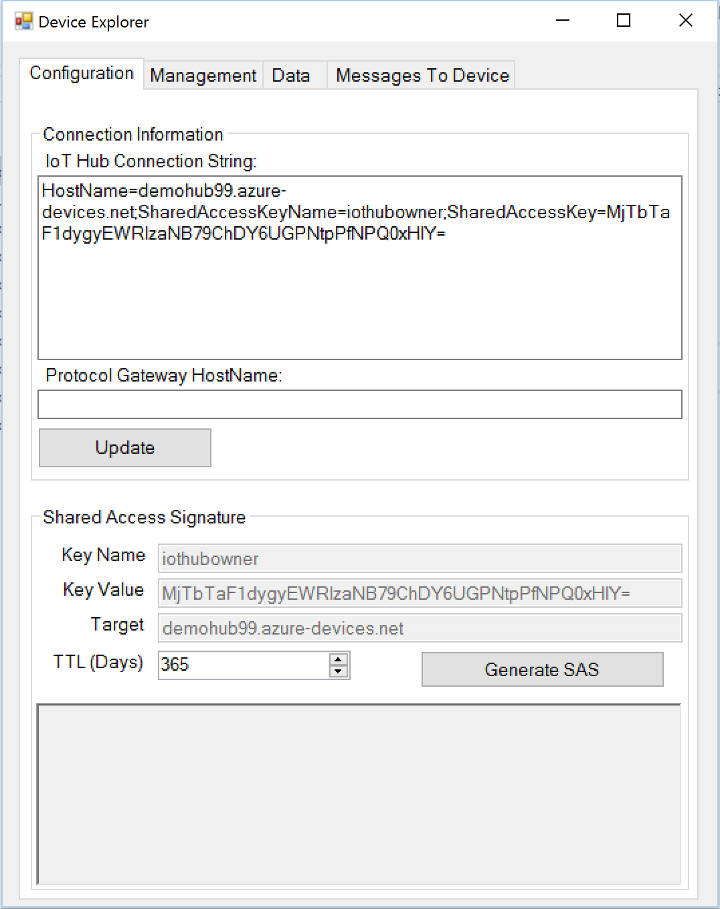
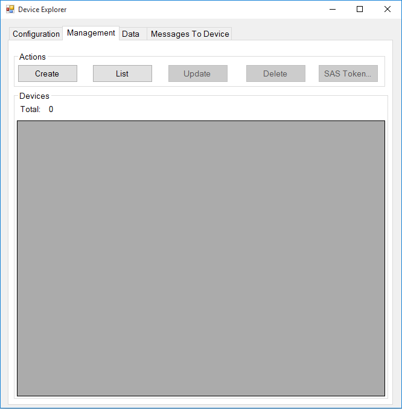
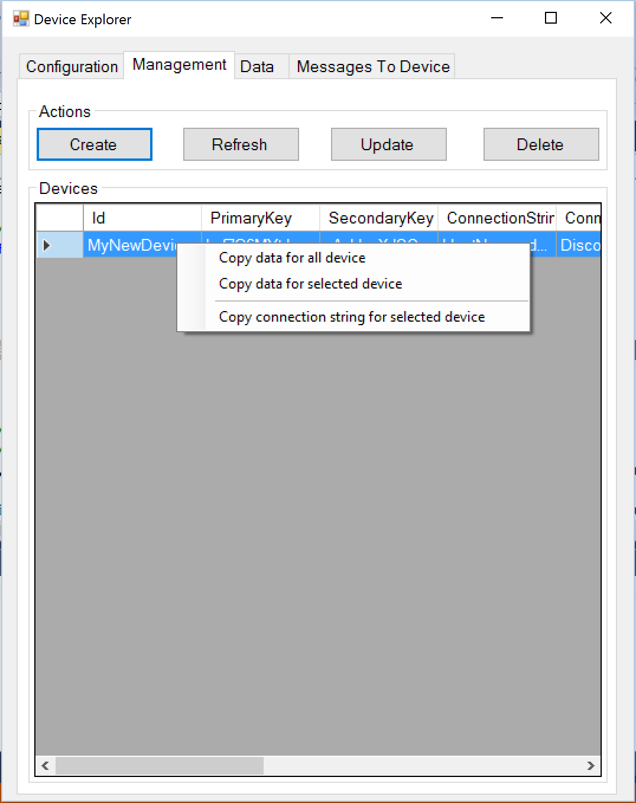
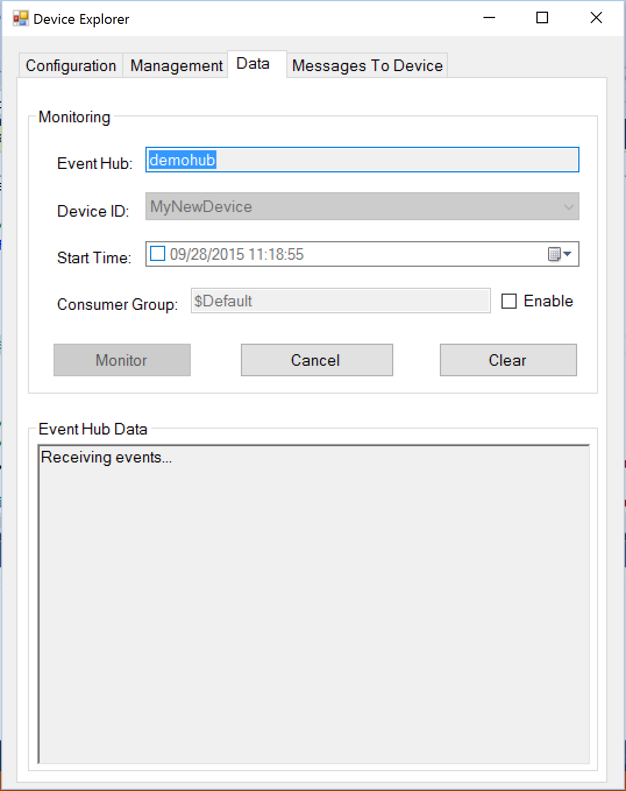
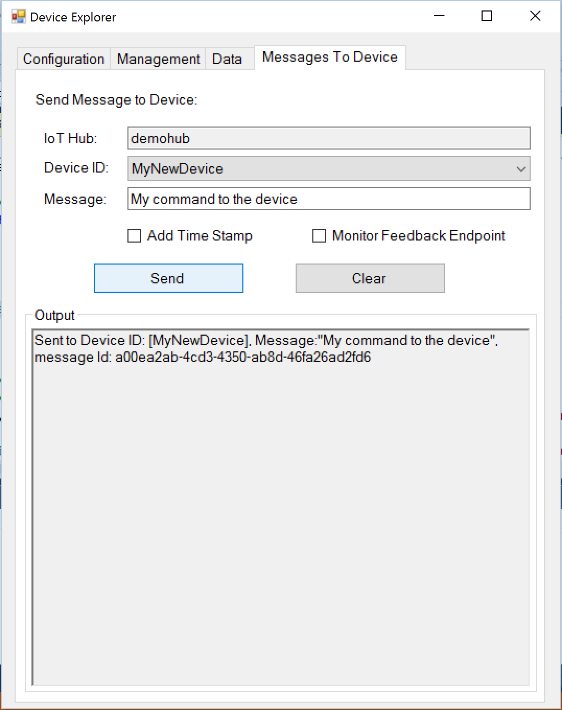

# How to use Device Explorer for IoT Hub devices
This topic describes how to download, build and use the Device Explorer tool. You can use this tool to manage devices connecting to your IoT hub. For example, you can register a device with your IoT hub, monitor messages from your devices, and send messages to your devices.

Device Explorer runs on your local machine and connects to your IoT hub in Azure. It communicates with the following [IoT Hub endpoints][lnk-devguide]:

- *Device identity management* to provision and manage devices registtered with your IoT hub.
- *Receive device-to-cloud* to enable you to monitor messages sent from your device to your IoT hub.
- *Send cloud-to-device* to enable you to send messages to your devices from your IoT hub.

> **Note:** The Device Explorer utility only runs on Windows. On other platforms use the [iothub explorer][iothub-explorer] tool.

To learn more about IoT Hub, see [What is Azure IoT Hub?][what-is-iot-hub].

## Table of Contents
- [Getting Device Explorer](#download)
- [Configure an IoT Hub connection](#configure)
- [Manage devices](#managedevices)
  - [List registered devices](#listdevices)
  - [Create device](#createdevice)
  - [Update device](#updatedevice)
  - [Delete device](#deletedevice)
  - [SAS Token](#sastoken)
  - [Get device connection string or data](#getdatadevice)
- [Monitor device-to-cloud events](#monitor)
- [Send cloud-to-device messages](#send)

<a name="download"/>
## Getting Device Explorer

You can either download a pre-built version of Device Explorer or build it yourself.

### Download a pre-built version of the Device Explorer application

A pre-built version of the Device Explorer application for Windows can be downloaded by clicking on this link [Downloads](https://github.com/Azure/azure-iot-sdks/releases) (Scroll down for __DeviceExplorer.msi__). The default installation directory for this application is "C:\Program Files (x86)\Microsoft\DeviceExplorer". You might want to pin the DeviceExplorer.exe application to the taskbar for easier access.


### Build the Device Explorer application

To build Device Explorer yourself, open the **tools\\DeviceExplorer\\DeviceExplorer.sln** file in your local copy of this repository ([azure-iot-sdks](https://github.com/Azure/azure-iot-sdks)) in Visual Studio 2015. Then build and run the solution.

<a name="configure"/>
## Configure an IoT Hub connection


-  In the **Configuration** tab, add the connection string for your IoT Hub. For information about how to find this connection string, see the document [Setup your IoT Hub][setup-iothub]. Then click **Update**.

  

### Configure a Protocol Gateway

You only need to complete this step if you are using a Protocol Gateway (such as the [Microsoft Azure IoT Protocol Gateway][protocol-gateway]).

Add the address of your protocol gateway to the **Protocol Gateway HostName** field with the address of your protocol gateway before you try to get a device connection string on the **Management** tab. If you are running the protocol gateway locally on the same machine as Device Explorer, you can use **localhost** as the address, otherwise you will need the network address of the machine where you deployed the protocol gateway.

<a name="managedevices"/>
## Manage devices
-  Click the **Management** tab to manage the devices connected to the IoT hub.

  

<a name="listdevices"/>
-  Click **List** to query the list of registered devices with the connected IoT Hub.

<a name="createdevice"/>
### Create device

Creating a device adds device details to the device identity registry. IoT Hub uses this information to generate a device-specific connection string that enables the device to connect to the IoT hub.

-  On the **Management** tab, click **Create** to register a new device with that IoT Hub. The **Create Device** dialog appears. In the **Device ID** field, type a unique name for your device (or select **Auto Generate ID** to generate a unique ID instead). Then click **Create**.

  

-  A **Device Created** window appears, indicating that your device has been successfully registered with this IoT Hub.

  

<a name="updatedevice"/>
### Update device

- Click **Update** to change the primary or secondary key for the selected device. You will need to update your device to use any new keys you generate.


<a name="deletedevice"/>
### Delete device

- Click **Delete** to delete the selected devices from the connected IoT hub.

<a name="sastoken"/>
### SAS Token

- Click **SAS Token...** to generate a device specific connection string with SAS token.

<a name="getdatadevice"/>
### Get device connection string or configuration data

- Use the mouse right click for context menu for the selected device. The menu has the following options

  

<a name="monitor"/>
## Monitor device-to-cloud events

The following steps describe how to use Device Explorer to monitor device-to-cloud events sent from a sample application on a client to an IoT hub and use the **Device Explorer** utility to observe as the IoT hub receives the event data.

### Obtain the device connection string and setup monitoring

You can use one of the sample applications included in this repository ([azure-iot-sdks](https://github.com/Azure/azure-iot-sdks)) to send device-to-cloud events to your IoT Hub. Use Device Explorer to [create a device](#createdevice) and generate a connection string.

-  You can obtain the IoT Hub connection string from Device Explorer. In the Management tab, right-click on the selected device and select "Copy connection string for selected device". The device connection string is silently copied to the clipboard.

> Note: Device Explorer requires an IoT hub connection string obtained from the Azure portal to enable it to connect to the hub. You can then use Device Explorer to generate device-specific connection strings that enable devices to communicate with the hub.

- Update the device connection string placeholder in the sample application you are using with the connection string from Device Explorer.

-  In the Device Explorer **Data** tab, select the device name you created from the drop-down list of device IDs and leave the other fields with their default values for now.

-  Click **Monitor**.

  

-  Device Explorer is now monitoring data sent from that device to the IoT hub.

### Run the sample application

Run your sample application. Device Explorer should now show that the IoT hub has successfully received device-to-cloud data from this device.

  

<a name="send"/>
## Send cloud-to-device messages

-  To verify that you can send cloud-to-device messages from the IoT hub to your device, go to the **Messages To Device** tab in Device Explorer.

-  Select the device you created.

-  Add some text to the **Message** field, then click **Send**.

  

-  You should be able to see the command received in the console window for the client sample application you are using.

  

>Note: You must be sure to use the correct format when you send a message to your device. For example, the **simplesample_amqp** sample for the C serializer library accepts the following JSON commands:

```
{"Name":"SetAirResistance","Parameters":{"Position":55}}
{"Name":"TurnFanOn","Parameters":{}}
```


[setup-iothub]: ../../../doc/setup_iothub.md
[protocol-gateway]: https://github.com/Azure/azure-iot-protocol-gateway
[lnk-devguide]: https://azure.microsoft.com/documentation/articles/iot-hub-devguide/
[what-is-iot-hub]: https://azure.microsoft.com/documentation/articles/iot-hub-what-is-iot-hub/
[iothub-explorer]: ../../iothub-explorer/doc/provision_device.md
